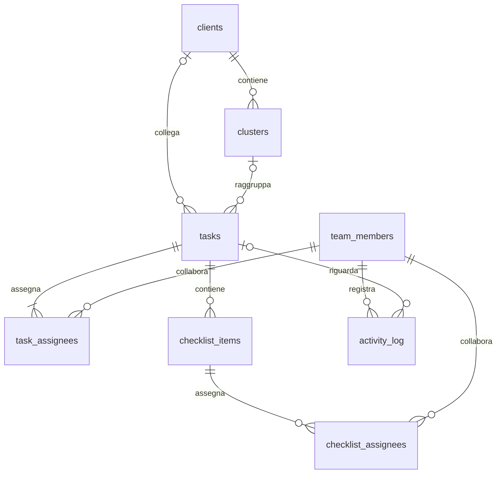

# ENG Workspace — architettura

Applicazione client in HTML, CSS e JavaScript ES modules, compilata con Vite. Supabase fornisce autenticazione e PostgreSQL. ExcelJS viene caricato solo quando serve l’export. Nessun server Node da mantenere in produzione.

## Strati e responsabilità

- `domain.js`: date, filtri, ordinamento, validazione e KPI puri, condivisi da UI ed Excel.
- `repository.js`: contratto di persistenza. RPC Supabase in produzione; adapter locale esplicito per demo. L’app non passa automaticamente alla demo se Supabase non risponde.
- `state.js`: snapshot del workspace e filtri della sessione.
- `ui.js`: viste operative e componenti di presentazione; testo sempre escapato.
- `panels.js`: form, dialoghi accessibili, focus, conferme e avatar.
- `app.js`: eventi dell’interfaccia, flussi asincroni, coordinamento salvataggi e aggiornamenti.
- `auth.js`, `config.js`, `supabase.js`: accesso condiviso e configurazione pubblica.
- `export.js`: workbook con quattro fogli, formattazione e valori tipizzati.

## Modello relazionale

`client_id` è facoltativo su cluster e attività. Un cluster con cliente impone lo stesso cliente sulle attività collegate; un cluster interno può raggruppare anche attività con cliente. Spostare un cluster popolato tra clienti richiede prima di scollegarne le attività. Questo evita correzioni massive implicite.

## Accesso e integrità

Una riga in `private.workspace_access` autorizza l’UUID dell’account Supabase Auth condiviso. Le regole RLS consentono lettura esclusivamente a tale account. Gli altri account autenticati non vedono righe; gli anonimi non hanno grant. L’interfaccia non offre registrazione pubblica.

Le scritture passano esclusivamente da quattro RPC pubbliche. I wrapper sono `SECURITY INVOKER`; le implementazioni private sono `SECURITY DEFINER`, con `search_path` vuoto e verifica esplicita dell’accesso e del membro attivo. Lo schema `private` deve restare escluso dalla Data API. INSERT/UPDATE/DELETE diretti sulle tabelle e falsificazione del log sono negati al client. Le funzioni private ausiliarie non sono eseguibili dal ruolo authenticated.

Ogni salvataggio di attività esegue una transazione unica: riga attività, assegnatari, checklist, responsabili della checklist e log. `SELECT FOR UPDATE` e il timestamp `updated_at` atteso impediscono modifiche perse; una versione obsoleta restituisce un errore esplicito. Anche l’eliminazione verifica la versione. Il blocco sulle modifiche dei membri impedisce di disattivare contemporaneamente tutti i membri.

Il membro selezionato identifica l’autore operativo dichiarato, non un’identità autenticata separata. Come richiesto, tutti gli utilizzatori dell’account condiviso possono scegliere qualsiasi membro e modificare tutte le attività. Lo storico non è una prova individuale di identità.

## Sincronizzazione

La lettura restituisce un singolo snapshot coerente, senza limiti REST di 1.000 righe sulle relazioni. Aggiornamento dopo ogni salvataggio, al ritorno sulla finestra e ogni 30 secondi quando l’utente non sta modificando un form. Il pannello aperto conserva la propria bozza; un conflitto richiede di riaprirlo. Le richieste di aggiornamento vengono serializzate.

La modalità condivisa richiede rete. Un errore non viene presentato come salvataggio riuscito; non esiste una coda offline implicita. In demo, il workspace persiste nel browser; la scelta del membro usa sessionStorage in entrambe le modalità.

## Decisioni UX

Sette sezioni principali. Il team si gestisce da un comando discreto nel footer della sidebar. Dashboard personale iniziale, filtri temporali con completate escluse, board con trascinamento e alternativa tramite selettore. I dialoghi gestiscono focus, Tab, Escape, conferma delle modifiche non salvate e stato di invio. La tabella scorre orizzontalmente sugli schermi più stretti.

Avatar caricati da file JPG/PNG/WebP, ritagliati al centro e ridimensionati localmente a 160 px. Il risultato WebP viene salvato come piccola data URL nella riga membro; nessun bucket pubblico, URL remoto, SVG eseguibile o servizio aggiuntivo. Limiti: 5 MB in ingresso e 350.000 caratteri nel database.

## Metriche

Le attività sono conteggiate per ID unico nei totali. Una task condivisa contribuisce al carico di ogni assegnatario. Completamento = completate/totali. Scadute = aperte con data antecedente a oggi. Percentuale scadute = scadute/totali. Puntualità = completate entro il giorno di scadenza/completate con scadenza e timestamp di completamento; senza denominatore è N/D. Checklist = elementi completati/elementi totali, senza media delle percentuali delle task.

Giorno operativo e completamenti sono riferiti a Europe/Rome. Scadenze `date`, eventi `timestamptz`. Oggi è separato dalle scadute; settimana fino alla domenica corrente inclusa; prossimi sette giorni da oggi a oggi+7 inclusi. Le task completate rientrano solo nella vista Tutte o nel filtro di stato esplicito.

## Limiti operativi dichiarati

Snapshot completo pensato per un piccolo team: se si raggiungono decine di migliaia di attività, introdurre paginazione e aggregazioni server. La UI mostra gli ultimi 500 eventi globali; il database conserva tutto il log. Nessun allegato generico, notifica email, permesso per persona o automazione è stato aggiunto fuori dal perimetro richiesto. La creazione del progetto Supabase e il collaudo Auth remoto restano passi di messa in servizio.
